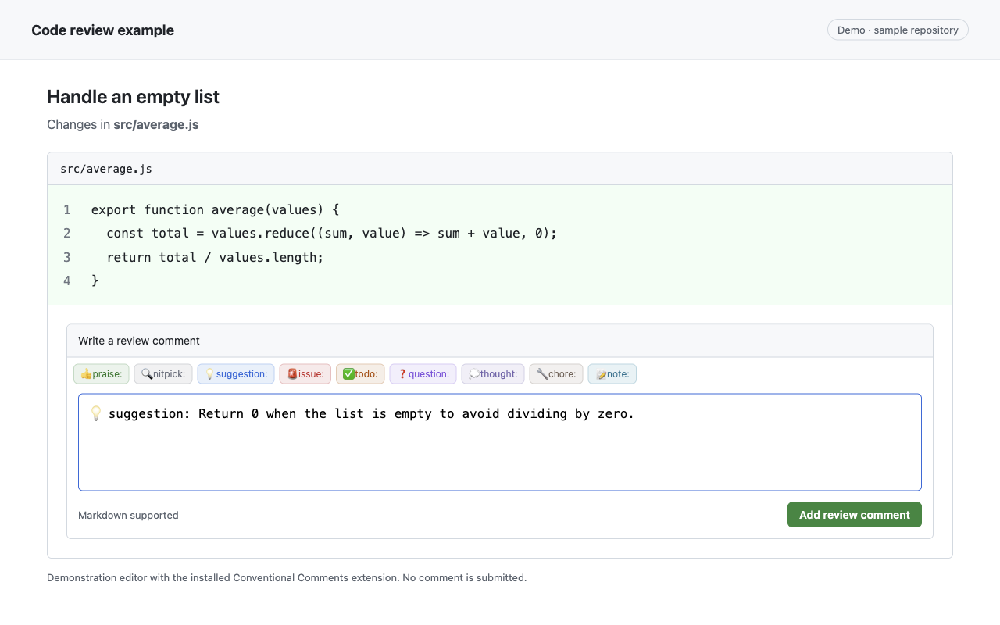
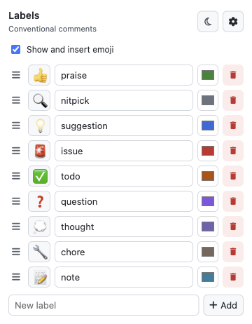
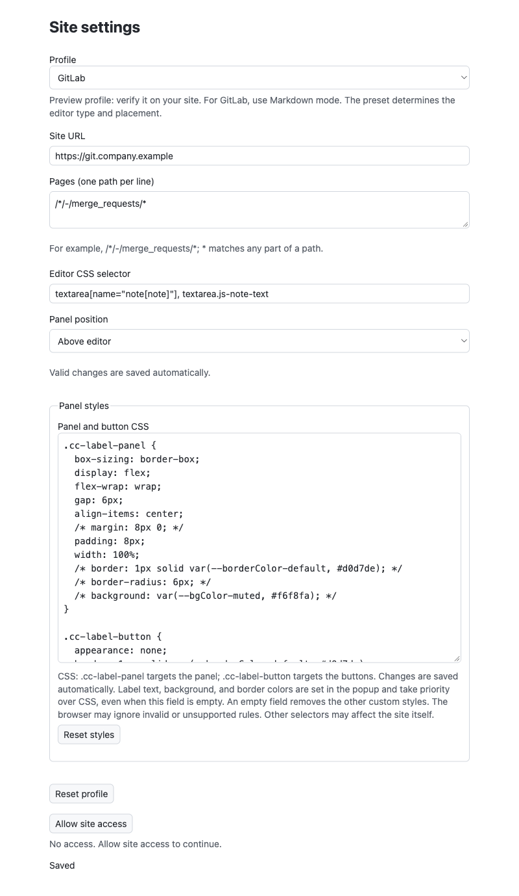

# Conventional Comments

### Available at chrome store
  

Add labels such as `suggestion:`, `issue:`, and `question:` to code review comments in Chrome. The extension places label buttons next to the review editor and inserts the selected prefix at the start of your comment. You write and submit the comment using the site's usual controls.

Based on the original [Conventional Comments](https://conventionalcomments.org/) idea and format. This extension provides configurable labels and optional emoji for that workflow.

## How to use

1. Open a GitHub pull request and its **Files changed** view.
2. Open a comment editor next to a line of code.
3. Click a label, then write your feedback. You can also choose a label after writing: the prefix is added before your text.
4. Submit the comment or review with GitHub's normal controls.

For example: `💡 suggestion: Return 0 when the list is empty.`

*Demo editor with the real extension panel; this is not a screenshot of GitHub.*

## Customize labels

Click the extension's toolbar icon to open **Labels**. Edit names, drag rows to reorder them, add a label with **New label**, or remove one with the trash button. Changes save automatically; wait for **Saved** after an edit.

Use the color swatch to choose a label color. Click the emoji button to the left of a name to search in English or choose **No emoji**. Turn off **Show and insert emoji** to keep your selections but insert plain prefixes. Emoji search works offline. The theme button switches the popup and settings between light and dark.

Labels are shared across site profiles. Readers see the inserted text without installing the extension.

## Company repositories

Configure your browser for your company's site; no repository files or server plugin are needed.

1. Open the popup and click the gear button, **Settings**.
2. Select the matching **Profile**: GitHub, GitLab, or Bitbucket.
3. Set **Site URL** to the site origin, such as `https://git.company.example`, without a repository path.
4. Set **Pages (one path per line)** to the review paths. For GitLab, use `/*/-/merge_requests/*`; `*` matches any part of a path.
5. Keep the preset **Editor CSS selector** unless your site's editor needs a different one. Choose **Above editor** or **Below editor** under **Panel position**.
6. Wait for **Saved**, click **Allow site access**, and approve Chrome's request. Open or reload a review page and its comment editor.

Each profile has one site address: changing it replaces that profile's previous address. GitLab and Bitbucket profiles are **preview support** and need checking on your site. Use **Markdown mode** in GitLab; a different editor type may remain incompatible even after changing its selector.

*Example configuration before granting access. Saving settings alone does not grant site access.*
